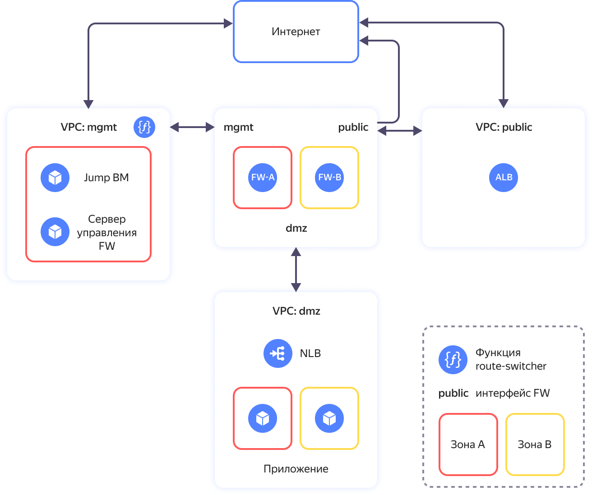
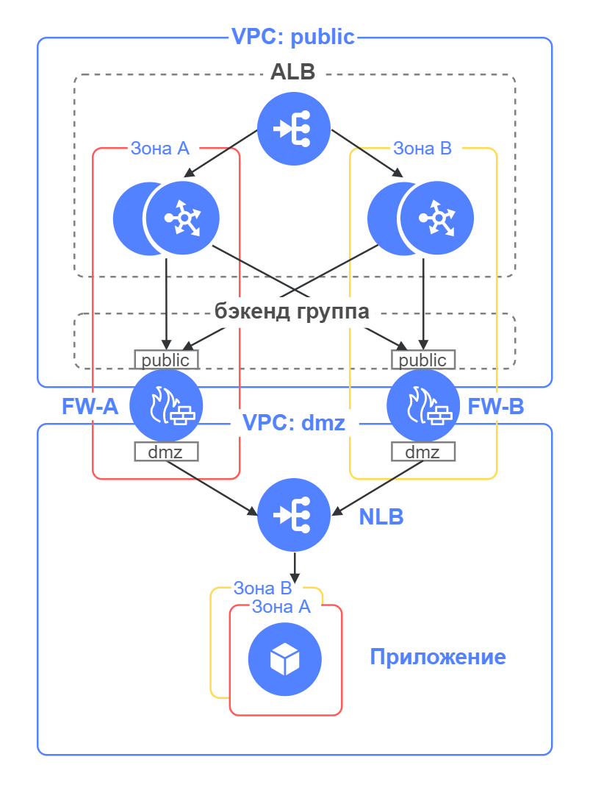
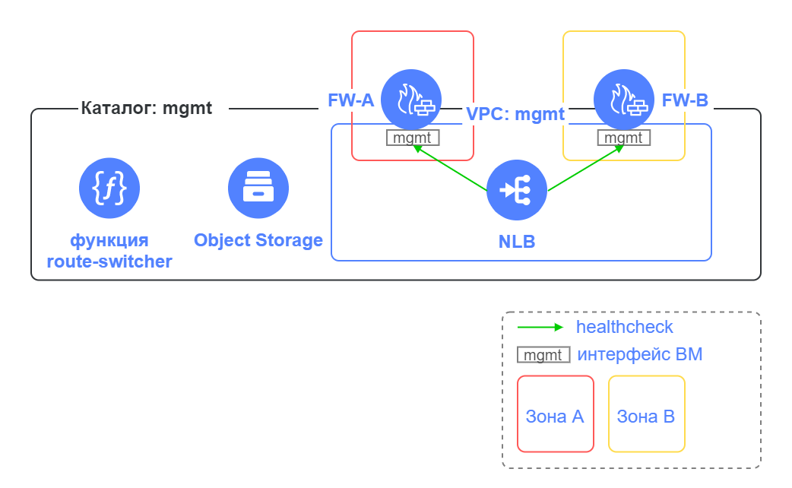
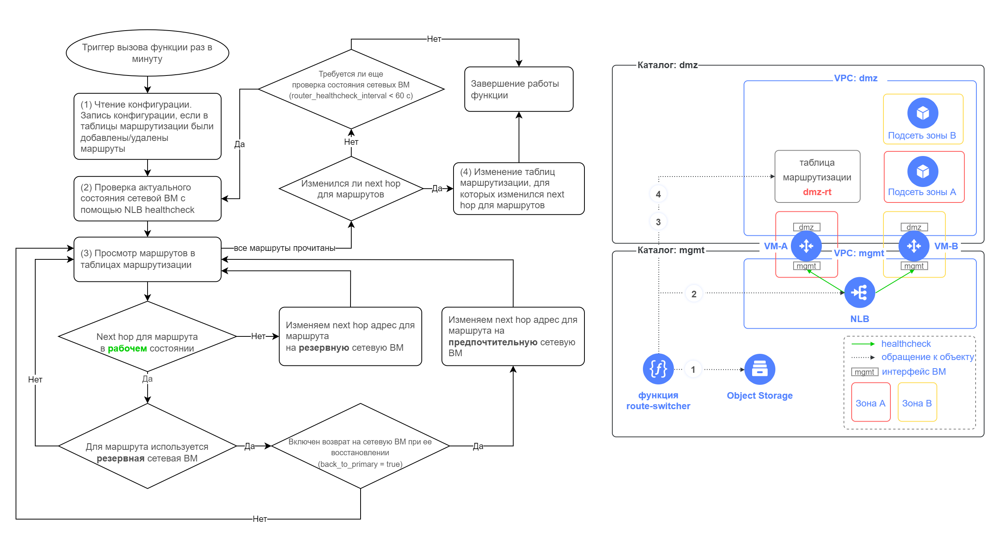

# Реализация защищенной высокодоступной сетевой инфраструктуры с выделением DMZ на основе UserGate NGFW

## Содержание
- [Описание решения](#описание-решения)
- [Архитектура решения и основные компоненты](#архитектура-решения-и-основные-компоненты)
- [Разворачиваемые сегменты и ресурсы](#разворачиваемые-сегменты-и-ресурсы)
- [Подготовка к развертыванию](#подготовка-к-развертыванию)
- [Развертывание Terraform сценария](#развертывание-terraform-сценария)
- [Действия после развертывания сценария](#действия-после-развертывания-сценария)
- [Подключение к сегменту управления](#подключение-к-сегменту-управления)
- [Настройка NGFW](#настройка-ngfw)
- [Включение работы модуля route-switcher](#включение-работы-модуля-route-switcher)
- [Проверка работоспособности](#проверка-работоспособности)
- [Проверка отказоустойчивости](#проверка-отказоустойчивости)
- [Требования к развертыванию в продуктивной среде](#требования-к-развертыванию-в-продуктивной-среде)
- [Удаление созданных ресурсов](#удаление-созданных-ресурсов)


## Описание решения

Сценарий разворачивает в Yandex Cloud облачную инфраструктуру для решения задач:
- защиты и сегментации инфраструктуры на зоны безопасности
- публикации приложений в интернет из зоны [DMZ](https://ru.wikipedia.org/wiki/DMZ_(компьютерные_сети))
- обеспечения высокой доступности развернутых приложений

Каждый сегмент сети (далее сегмент) содержит ресурсы одного назначения, обособленные от других ресурсов. Например, DMZ сегмент предназначен для размещения общедоступных приложений. В облаке каждому сегменту соответствует свой каталог и своя облачная сеть VPC. Связь между сегментами происходит через виртуальные машины Next-Generation Firewall (NGFW), обеспечивающие комплексную защиту сегментов и контроль трафика между сегментами. 

Высокая доступность архитектуры достигается за счет:
- использования двух NGFW
- размещения ресурсов в двух зонах доступности
- сервиса [Application Load Balancer](#application-load-balancer-alb) для отказоустойчивости и балансировки опубликованных приложений в DMZ
- [Облачной функции](#terraform-модуль-route-switcher) для переключения исходящего из сегмента трафика при отказе NGFW


## Архитектура решения и основные компоненты


<br><br>

Описание элементов схемы:

| Название элемента | Описание | Комментарии |
| ----------- | ----------- | ----------- | 
| VPC: public | Сегмент сети public | Для организации публичного доступа из интернет | 
| VPC: mgmt | Сегмент сети mgmt | Для управления облачной инфраструктурой и размещения служебных ресурсов | 
| VPC: dmz | Сегмент сети DMZ | Для размещения приложений, доступных из интернет | 
| FW-A | Виртуальная машина UserGate NGFW | Для защиты инфраструктуры и сегментации сети на зоны безопасности. Активен для входящего трафика и исходящего трафика. |
| FW-B | Виртуальная машина UserGate NGFW | Для защиты инфраструктуры и сегментации сети на зоны безопасности. Активен для входящего трафика и в резерве для исходящего трафика. |
| ALB | Балансировщик нагрузки на FW-A и FW-B | Для балансировки и отказоустойчивости опубликованных в DMZ приложений |
| Функция route-switcher | Облачная функция | Для переключения таблицы маршрутизации в сегменте | 
| Jump ВМ | Виртуальная машина c настроенным [WireGuard VPN](https://www.wireguard.com/) | Для защищенного VPN подключения к сегменту управления |
| NLB | Сетевой балансировщик на группу веб-серверов | Для балансировки трафика на веб-серверы тестового приложения в DMZ сегменте |
| Приложение | ВМ с веб-сервером Nginx | Пример тестового приложения, развернутого в DMZ сегменте |

</details>

Ключевыми элементами решения являются: 
- [Next-Generation Firewall](#next-generation-firewall)
- [Application Load Balancer](#application-load-balancer-alb)
- [Terraform модуль route-switcher](#terraform-модуль-route-switcher)
- [Группы безопасности](#группы-безопасности)

FW-A и FW-B работают в режиме Active/Active для входящего в DMZ трафика и в режиме Active/Standby для исходящего трафика из сегментов.


В случае отказа FW-A сетевая связанность с интернетом и между сегментами будет выполняться через FW-B


### Next-Generation Firewall

NGFW используется для защиты и сегментации облачной сети с выделением DMZ зоны для размещения публичных приложений.
В [Yandex Cloud Marketplace](https://cloud.yandex.ru/marketplace?categories=security) доступно несколько вариантов NGFW.

В данном сценарии развернуто решение [UserGate NGFW](https://yandex.cloud/ru/marketplace/products/usergate/ngfw), предоставляющее функционал:
- Межсетевое экранирование
- Обнаружение и предотвращение вторжений
- Управление трафиком и контроль доступа в интернет
- Контент-фильтрация и контроль приложений
- VPN-сервер
- Потоковый антивирус
- Защита от DoS-атак и сетевого флуда

UserGate NGFW в данном примере настроен с базовыми правилами межсетевого экранирования и NAT трансляций.

Подробнее познакомиться с возможностями UserGate NGFW можно в [документации](https://www.usergate.com/ru/products/usergate-vm).


### Application Load Balancer (ALB)



Для балансировки трафика приложений и отказоустойчивости в работе приложений, опубликованных в DMZ, используется [ALB](https://cloud.yandex.ru/docs/application-load-balancer/concepts/), который балансирует запросы пользователей на public интерфейсы FW-A и FW-B. Таким образом обеспечивается работа FW-A и FW-B в режиме Active/Active для входящего трафика в DMZ.
В примере используется группа бэкендов Stream (TCP) с [привязкой пользовательской сессии](https://cloud.yandex.ru/docs/application-load-balancer/concepts/backend-group#session-affinity) к эндпойнту (FW) на основе IP адреса пользователя.
По умолчанию балансировщик ALB равномерно распределяет трафик между FW-A и FW-B. Можно настроить [локализацию трафика](https://cloud.yandex.ru/docs/application-load-balancer/concepts/backend-group#locality), чтобы ALB отправлял запросы к FW той зоны доступности, в которой балансировщик принял запрос. Если в этой зоне доступности нет работающего FW, балансировщик отправит запрос в другую зону.


> **Важная информация**
>  
> На FW-A и FW-B необходимо настроить Source NAT на IP адрес FW в сегменте dmz для обеспечения прохождения ответа от приложения через тот же FW, через который поступил запрос от пользователя. Смотрите раздел [Настройка базовых политик безопасности](#настройка-базовых-политик-безопасности) пункт 9.

Application Load Balancer предоставляет расширенные возможности, среди которых:
- Поддержка протоколов: HTTP/S, HTTP/S WebSocket, TCP/TLS, HTTP/S gRPC 
- Гибкое распределение трафика между бэкендами приложений
- Обработка TLS-трафика: установка соединения и терминация TLS-сессий с помощью сертификатов из Yandex Сertificate Manager
- Возможность привязки пользовательской сессии и выбор режимов балансировки
- Создание и модификация ответов на запросы
- Анализ логов


### Terraform модуль route-switcher

В облачной сети Yandex Cloud не поддерживается работа протоколов VRRP/HSRP между FW. 

Для обеспечения отказоустойчивости исходящего трафика из сегмента используется [решение yc-route-switcher](https://github.com/yandex-cloud-examples/yc-route-switcher/), которое выполняет следующие действия:
- Переключение next hop адресов в таблицах маршрутизации при отказе FW-A на FW-B
- Возврат next hop адресов в таблицах маршрутизации на FW-A после его восстановления

В данном сценарии подсети используют таблицу маршрутизации через FW-A для исходящего из сегмента трафика.

Среднее время реакции на сбой составляет 1 мин. Возможно уменьшить интервал между последовательными проверками состояния сетевых ВМ во время работы облачной функции с помощью задания параметра `router_healthcheck_interval` во [входных параметрах](https://github.com/yandex-cloud-examples/yc-route-switcher/?tab=readme-ov-file#входные-параметры-модуля) модуля route-switcher. По умолчанию это значение 60 с. Если меняется значение по умолчанию, то рекомендуется дополнительно провести тестирование сценариев отказоустойчивости. Не рекомендуется устанавливать значение интервала менее 10 с.




Модуль route-switcher создает следующие ресурсы, необходимые для его работы:
- Облачную функцию route-switcher
- NLB 
- Бакет в Object Storage 

Описание элементов схемы:

| Название элемента | Описание |
| ----------- | ----------- |
| Каталог: mgmt | Каталог для размещения компонент модуля route-switcher |
| VPC: mgmt | В подсетях сегмента управления расположены сетевые интерфейсы FW-A и FW-B, используемые для проверки их доступности |
| FW-A, FW-B | Виртуальные машины UserGate NGFW, для которых требуется обеспечить отказоустойчивость |
| Функция route-switcher | Облачная функция, которая выполняет проверку состояния FW-A и FW-B и в случае недоступности FW-A переключает next hop адреса в таблицах маршрутизации на FW-B. Также функция возвращает next hop адреса в таблицах маршрутизации на FW-A после его восстановления. | 
| NLB | Сетевой балансировщик для мониторинга доступности FW-A и FW-B |
| Object Storage | Бакет в Object Storage для хранения файла конфигурации с информацией:<br>- таблицы маршрутизации с указанием предпочтительных next hop адресов для префиксов<br>- IP-адреса FW-A и FW-B: для проверки доступности, адреса для каждого сетевого интерфейса FW (IP-адрес FW и соответствующий IP-адрес резервного FW) |


### Алгоритм работы функции route-switcher

<details>
<summary>Посмотреть подробности</summary>

Функция route-switcher вызывается по триггеру раз в минуту (значение по умолчанию), проверяет в каком состоянии находятся сетевые ВМ, и в случае недоступности сетевых ВМ переключает next hop адреса в таблицах маршрутизации. При восстановлении сетевой ВМ функция route-switcher возвращает ее next hop адреса в таблицах маршрутизации (если настроена такая опция).

Возможно уменьшить интервал между последовательными проверками состояния сетевых ВМ во время работы облачной функции с помощью задания параметра `router_healthcheck_interval` во входных параметрах модуля. По умолчанию это значение 60 с. Если меняется значение по умолчанию, то рекомендуется дополнительно провести тестирование сценариев отказоустойчивости. Не рекомендуется устанавливать значение интервала менее 10 с.



</details>


### Группы безопасности

Группы безопасности используются для контроля трафика между ресурсами внутри сегмента.

В данном сценарии группы безопасности разрешают входящий трафик по портам TCP 443, 22 и ICMP пакеты от источников внутри группы, а также разрешают любой исходящий трафик. Группы безопасности в сегментах mgmt, dmz, public также имеют дополнительные разрешения, например, для работы балансировщиков, NGFW и других развернутых ресурсов.

## Разворачиваемые сегменты и ресурсы

Решение создает в облаке ресурсы для 3 сегментов. При необходимости развертывания большего количества сегментов заполните соответствующие значения переменных в файле `terraform.tfvars` (см. пункт 3 раздела [Развертывание Terraform сценария](#развертывание-terraform-сценария)). Решение поддерживает развертывание не более 7 сегментов.


<details>
<summary>Посмотреть подробности</summary>

| Сегмент | Описание | Ресурсы | Каталоги и сети | Группы безопасности | 
| ----------- | ----------- | ----------- | ----------- | ----------- |
| public | публичный доступ из интернет | ALB | + | + |
| mgmt | управление облачной инфраструктурой | 2 x UserGate NGFW, Jump ВМ с WireGuard для подключения из интернет, облачная функция route-switcher, NLB для проверки доступности NGFW, бакет для хранения файла конфигураций для функции route-switcher | + | + |
| dmz | для размещения приложений, доступных из интернет | NLB для балансировки по веб-серверам, группа виртуальных машин с 2-мя веб-серверами Nginx для примера | + | + |

</details>


## Подготовка к развертыванию

1. Перед выполнением развертывания нужно [зарегистрироваться в Yandex Cloud и создать платежный аккаунт](https://cloud.yandex.ru/docs/tutorials/infrastructure-management/terraform-quickstart#before-you-begin)

2. [Установите Terraform](https://cloud.yandex.ru/docs/tutorials/infrastructure-management/terraform-quickstart#install-terraform)

3. Проверьте наличие учетной записи в облаке с правами admin на облако

4. [Установите и настройте Yandex Cloud CLI](https://cloud.yandex.ru/docs/cli/quickstart)

5. [Установите Git](https://github.com/git-guides/install-git)

6. Проверьте квоты в облаке, чтобы была возможность развернуть ресурсы в сценарии:

    <details>
    <summary>Посмотреть справочную информацию по количеству ресурсов, создаваемых в сценарии</summary>

    | Ресурс | Количество |
    | ----------- | ----------- |
    | Каталоги | 3 |
    | Группы виртуальных машин | 1 |
    | Виртуальные машины | 5 |
    | vCPU виртуальных машин | 14 |
    | RAM виртуальных машин | 38 ГБ |
    | Диски | 5 |
    | Объем SSD дисков | 400 ГБ |
    | Объем HDD дисков | 30 ГБ |
    | Облачные сети | 3 |
    | Подсети | 6 |
    | Таблицы маршрутизации | 2 |
    | Группы безопасности | 6 |
    | Статические публичные IP-адреса | 4 |
    | Публичные IP-адреса | 4 |
    | Статические маршруты | 5 |
    | Бакеты | 1 |
    | Cloud функции | 1 |
    | Триггеры для cloud функций | 1 |
    | Общий объём RAM всех запущенных функций | 128 МБ |
    | Балансировщики NLB | 2 |
    | Целевые группы для NLB | 2 |
    | Балансировщики ALB | 1 |
    | Группы бэкендов для ALB | 1 |
    | Целевые группы для ALB | 1 |

    </details>


## Развертывание Terraform сценария

1. Склонируйте репозиторий `yandex-cloud-examples/yc-dmz-with-high-available-usergate-ngfw` из GitHub и перейдите в папку сценария `yc-dmz-with-high-available-usergate-ngfw`:
    ```bash
    git clone https://github.com/yandex-cloud-examples/yc-dmz-with-high-available-usergate-ngfw.git
    cd yc-dmz-with-high-available-usergate-ngfw
    ```

2. Настройте окружение для развертывания ([подробности](https://cloud.yandex.ru/docs/tutorials/infrastructure-management/terraform-quickstart#get-credentials)):
    ```bash
    export YC_TOKEN=$(yc iam create-token)
    ```

3. Заполните файл `terraform.tfvars` вашими значениями переменных. Файл содержит примеры значений, но вы можете заменить их своими данными (идентификатор облака, зоны доступности, названия сегментов, сетевые префиксы для подсетей сегментов, порт приложения в DMZ, параметры для подключения к Jump ВМ). Обязательно укажите идентификатор вашего облака `cloud_id` и список публичных IP адресов/подсетей `trusted_ip_for_access_jump-vm`, с которых разрешено подключение к Jump ВМ. 

    <details>
    <summary>Посмотреть переменные в terraform.tfvars</summary>

    | Название<br>параметра | Нужно<br>изменение | Описание | Тип | Пример |
    | ----------- | ----------- | ----------- | ----------- | ----------- |
    | `cloud_id` | да | Идентификатор вашего облака в Yandex Cloud | `string` | `b1g8dn6s3v2eiid9dbci` |
    | `az_name_list` | - | Список из двух <a href="https://cloud.yandex.ru/docs/overview/concepts/geo-scope">зон доступности</a> Yandex Cloud для размещения ресурсов | `list(string)` | `["ru-central1-a", "ru-central1-b"]` |
    | `security_segment_names` | - | Список названий сегментов. Первый сегмент для размещения ресурсов управления, второй с публичным доступом в интернет, третий для DMZ. Если требуются дополнительные сегменты, то нужно добавлять их в конец списка. При добавлении сегмента обязательно добавьте префиксы для подсетей в списки `zone1_subnet_prefix_list` и `zone2_subnet_prefix_list`. | `list(string)` |  `["mgmt", "public", "dmz"]` |
    | `zone1_subnet_prefix_list` | - | Список сетевых префиксов в первой зоне доступности для подсетей, соответствующих списку названия сегментов `security_segment_names`. По одному префиксу для сегмента. | `list(string)` | `["192.168.1.0/24", "172.16.1.0/24", "10.160.1.0/24"]` |
    | `zone2_subnet_prefix_list` | - | Список сетевых префиксов во второй зоне доступности для подсетей, соответствующих списку названия сегментов `security_segment_names`. По одному префиксу для сегмента. | `list(string)` | `["192.168.2.0/24", "172.16.2.0/24", "10.160.2.0/24"]` |
    | `public_app_port` | - | TCP порт для опубликованного в DMZ приложения для подключения из интернет | `number` | `80` |
    | `internal_app_port` | - | Внутренний TCP порт опубликованного в DMZ приложения, на который NGFW будет направлять трафик. Может отличаться от public_app_port или совпадать с ним. | `number` | `8080` |
    | `trusted_ip_for_access_jump-vm` | да | Список публичных IP адресов/подсетей, с которых разрешено подключение к Jump ВМ. Используется во входящем правиле группы безопасности для Jump ВМ. | `list(string)` | `["A.A.A.A/32", "B.B.B.0/24"]` |
    | `jump_vm_admin_username` | - | Имя пользователя для подключения к Jump ВМ по SSH | `string` | `admin` |
    | `wg_port` | - | UDP порт для входящих соединений в настройках WireGuard на Jump ВМ | `number` | `51820` |
    | `wg_client_dns` | - | Список адресов DNS серверов в облачной сети управления, которые будет использовать рабочая станция администратора после поднятия туннеля WireGuard к Jump ВМ | `string` | `192.168.1.2, 192.168.2.2` |

    </details>

4. Выполните инициализацию Terraform:
    ```bash
    terraform init
    ```

5. Проверьте конфигурацию Terraform файлов:
    ```bash
    terraform validate
    ```

6. Проверьте список создаваемых облачных ресурсов:
    ```bash
    terraform plan
    ```

7. Создайте ресурсы. На развертывание всех ресурсов в облаке потребуется около 7 мин:
    ```bash
    terraform apply
    ```

8. После завершения процесса terraform apply в командной строке будет выведен список информации о развернутых ресурсах. В дальнейшем его можно будет посмотреть с помощью команды `terraform output`:

    <details>
    <summary>Посмотреть информацию о развернутых ресурсах</summary>

    | Название | Описание | Пример значения |
    | ----------- | ----------- | ----------- |
    | `dmz-web-server-nlb_ip_address` | IP адрес балансировщика трафика в сегменте dmz, за которым находится целевая группа с веб-серверами для тестирования публикации приложения из dmz. Используется для настройки Destination NAT в FW. | `"10.160.1.100"` |
    | `fw-a_ip_address` | IP адрес в сети управления для FW-A | `"192.168.1.10"` |
    | `fw-alb_public_ip_address` | Публичный IP адрес балансировщика ALB. Используется для обращения к опубликованному в DMZ приложению из интернет. | `"C.C.C.C"` |
    | `fw-b_ip_address` | IP адрес в сети управления для FW-B | `"192.168.2.10"` |
    | `jump-vm_path_for_WireGuard_client_config` | Файл конфигурации для защищенного VPN подключения с помощью клиента WireGuard к Jump ВМ | `"./jump-vm-wg.conf"` |
    | `jump-vm_public_ip_address_jump-vm` | Публичный IP адрес Jump ВМ | `"D.D.D.D"` |
    | `path_for_private_ssh_key` | Файл с private ключом для подключения по протоколу SSH к ВМ (jump-vm, fw-a, fw-b, веб-серверы в сегменте dmz) | `"./pt_key.pem"` |

    </details>

## Действия после развертывания сценария

После успешного развертывания сценария Terraform рекомендуется выполнить следующую последовательность действий:
1. Ознакомиться с [требованиями к развертыванию в продуктивной среде](#требования-к-развертыванию-в-продуктивной-среде)
2. [Подключиться к сегменту управления](#подключение-к-сегменту-управления) с помощью Jump ВМ для настройки UserGate NGFW и доступа по SSH к развернутым ресурсам в облаке
3. [Настроить NGFW](#настройка-ngfw) под задачи вашей инфраструктуры или согласно приведенным шагам в качестве примера 
4. [Включить работу](#включение-работы-модуля-route-switcher) модуля route-switcher
5. Выполнить базовую [проверку работоспособности](#проверка-работоспособности) решения 
6. Выполнить базовую [проверку отказоустойчивости](#проверка-отказоустойчивости) решения 

> **Важная информация**
> 
> Без шагов настройки NGFW и включения работы модуля route-switcher проверить работоспособность и отказоустойчивость решения не получится.

## Подключение к сегменту управления

После выполнения развертывания в mgmt сегменте сети управления появляется Jump ВМ на основе образа Ubuntu с настроенным [WireGuard VPN](https://www.wireguard.com/) для защищенного подключения. После установления VPN туннеля к Jump ВМ на рабочей станции администратора появятся маршруты через VPN туннель к подсетям сегментов mgmt, public, dmz.  
Вы также можете подключиться к Jump ВМ по SSH, используя SSH ключ из вывода `terraform output` и логин из значения переменной `jump_vm_admin_username`.

1. Установите на рабочую станцию администратора [приложение WireGuard](https://www.wireguard.com/install/) для вашей операционной системы.

2. В папке с Terraform сценарием после создания ресурсов появляется файл `jump-vm-wg.conf` с настройками клиента WireGuard для подключения к Jump ВМ. Добавьте новый туннель (Import tunnel(s) from file) в приложении WireGuard для Windows или Mac OS, используя файл `jump-vm-wg.conf`. Активируйте туннель нажатием на кнопку Activate.  

3. Проверьте в командной строке с помощью `ping 192.168.1.101` сетевую связность с Jump ВМ через VPN туннель WireGuard. 

## Настройка NGFW

Вы можете настроить развернутые FW-A и FW-B под ваши задачи в соответствие с корпоративной политикой безопасности. Для управления и настройки UserGate NGFW используется веб-интерфейс. 

В качестве примера приводятся шаги настройки FW-A и FW-B с базовыми правилами межсетевого экранирования и NAT трансляций, необходимыми для проверки работоспособности и тестирования отказоустойчивости в сценарии, но не являющимися достаточными для развертывания инфраструктуры в продуктивной среде.

### Настройка FW-A

Подключитесь к веб-интерфейсу управления FW-A по https://192.168.1.10:8001. Учетная запись администратора: логин `Admin`, пароль `utm`. После подключения будет предложено заменить пароль.

#### Сетевые настройки

1. Перейдите в верхнем меню в раздел `Настройки`, в левом меню в секции `UserGate` выберите `Настройки`. Нажмите на значение поля `Часовой пояс`. Выберите Ваш часовой пояс и нажмите `Сохранить`. В полях `Основной NTP-сервер` и `Запасной NTP-сервер` укажите адреса NTP-серверов (см. [список рекомендуемых NTP-серверов](https://yandex.cloud/ru/docs/tutorials/infrastructure-management/ntp)).

1. В левом меню в секции `Сеть` выберите `Интерфейсы`. Нажмите на `port0`. На вкладке `Сеть` выберите `Режим: Статический`. Проверьте, что IP интерфейса `192.168.1.10`. Нажмите `Сохранить`.

1. Нажмите на `port1`. На вкладке `Общие` включите чекбокс `Включено`. Выберите `Зона: Untrusted`. На вкладке `Сеть` выберите `Режим: DHCP`. Нажмите `Сохранить`. Убедитесь, что интерфейс получил по DHCP IP адрес `172.16.1.10`. Нажмите еще раз на `port1`. На вкладке `Сеть` выберите `Режим: Статический` и нажмите `Сохранить`.

1. Повторите аналогичные действия для `port2`, указав `Зона: DMZ`. Убедитесь, что интерфейс получил по DHCP IP адрес `10.160.1.10`. 

1. В левом меню в секции `Сеть` выберите `Виртуальные маршрутизаторы`. Нажмите на символ &mdash; (широкое тире) в столбце `Статические маршруты` для `Виртуальный маршрутизатор по умолчанию`. С помощью кнопки `Добавить` добавьте статические маршруты согласно таблице: 

    | Название | Включено | Адрес назначения | Шлюз |
    | --- | --- | --- | --- |
    | `route to mgmt-zone2` | &#x2611; | `192.168.2.0/24` | `192.168.1.1` | 
    | `route to dmz-zone2` | &#x2611; | `10.160.2.0/24` | `10.160.1.1` |
    | `route to nlb-healthcheck-net1` | &#x2611; | `198.18.235.0/24` | `192.168.1.1` |
    | `route to nlb-healthcheck-net2` | &#x2611; | `198.18.248.0/24` | `192.168.1.1` |

1. В левом меню в секции `Сеть` выберите `Шлюзы`. Выберите строку с шлюзом с IP адресом `192.168.1.1`. Нажмите `Удалить` для удаления шлюза и подтвердите удаление. Нажмите `Добавить`. Заполните поля: `Название: public-gateway`, `Интерфейс: port1`, `IP шлюза: 172.16.1.1`. Включите чекбокс `По умолчанию` и нажмите `Сохранить`.  

1. В левом меню в секции `Сеть` выберите `DNS`. В разделе `Системные DNS-серверы` добавьте IP-адрес `192.168.1.2` облачного DNS-сервера в сегменте `mgmt`. 

#### Диагностика применения базовых настроек

1. Перейдите в верхнем меню в раздел `Диагностика и мониторинг`, в левом меню в секции `Мониторинг` выберите `Маршруты`. Проверьте, что в выводе маршрутной информации отображаются добавленные статические маршруты и шлюз по умолчанию.

1. В левом меню в секции `Сеть` выберите `Запрос DNS`. В поле `DNS-запрос (хост)` введите доменное имя ресурса в интернете, например, `ya.ru`. В поле `IP источника запроса` выберите `192.168.1.10`.  Нажмите `Старт` и проверьте, что доменное имя резолвится в публичные IP адреса.

1. В левом меню в секции `Сеть` выберите `Ping`. В поле `Ping host` введите доменное имя ресурса в интернете, например, `ya.ru`. Выберите `Интерфейс`: `port1`.  Нажмите `Старт` и проверьте, что ping успешно выполняется. В поле `Ping host` введите IP-адрес другого FW в сегменте `mgmt`. Выберите `Интерфейс`: `port0`.  Нажмите `Старт` и проверьте, что ping успешно выполняется.


> **Примечание**
> 
> Для подключения к UserGate по SSH используется по умолчанию порт 2200:
>
>```bash
>ssh -i pt_key.pem Admin@192.168.1.10 -p 2200
>```
> Подробнее об управлении UserGate с помощью интерфейса командной строки смотрите в [документации](https://docs.usergate.com/interfejs-komandnoj-stroki-(cli)_91.html).


#### Обновление ПО и обновление библиотек

Опционально можно обновить версию ПО UserGate. 

1. Перейдите в верхнем меню в раздел `Настройки`, в левом меню в секции `UserGate` выберите `Настройки`. В пункте `Расписание скачивания обновлений` нажмите `Проверка обновлений`. В открывшемся окне на вкладке `Обновление ПО` нажмите `Проверить обновления`. При наличии доступных обновлений их можно скачать.

1. На вкладке `Обновление библиотек` нажмите `Проверить обновления`. При наличии доступных обновлений их можно скачать.

1. После завершения скачивания обновлений в левом меню в секции `UserGate` выберите `Управление устройством`. В разделе `Операции с сервером` в пункте `Обновления сервера` нажмите `Установить сейчас`. Подтвердите установку обновлений. Во время обновления FW будет перезагружен.

#### Настройка базовых политик безопасности

1. Перейдите в верхнем меню в раздел `Настройки`, в левом меню в секции `Сеть` выберите `Зоны`. Нажмите на зону `Management` и перейдите на вкладку `Контроль доступа`. Проверьте, что для сервиса `Консоль администрирования` включен чекбокс &#x2611;. На этой же строке в колонке `Разрешённые адреса` нажмите на `Любой`. Добавьте подсети, с которых разрешен доступ к консоли администрирования UserGate. Нажмите `Добавить`. Укажите `192.168.1.0/24` и нажмите `Сохранить`. Таким же образом добавьте еще подсеть `192.168.2.0/24`. После этого в окне `Выберите IP-адрес/подсеть` нажмите `Сохранить`.

1. Для зоны `Management` в сервис `CLI по SSH` подобным образом добавьте разрешенные адреса `192.168.1.0/24` и `192.168.2.0/24`, с которых разрешен доступ по SSH для управления UserGate.

1. Для зоны `Management` в сервис `Captive-портал и страница блокировки` подобным образом добавьте разрешенные адреса `198.18.235.0/24` и `198.18.248.0/24`, используемые сетевым балансировщиком `route-switcher-lb-...` модуля `route-switcher` для проверки доступности UserGate.

1. В левом меню в секции `Библиотеки` выберите `IP-адреса`. Добавьте группы в разделе `Группы` и для каждой группы добавьте IP-адреса в разделе `Адреса из выбранной группы` в соответствие с таблицей:

    | Название | Уровень угрозы | Адреса из выбранной группы |
    | ----------- | ----------- | ----------- |
    | `mgmt` | средний | `192.168.1.0/24`<br>`192.168.2.0/24` |
    | `dmz` | средний | `10.160.1.0/24`<br>`10.160.2.0/24` |
    | `FW-a-public-IP` | средний | `172.16.1.10` |
    | `dmz-web-server` | средний | `10.160.1.100` |

1. В левом меню в секции `Библиотеки` выберите `Сервисы` и нажмите `Добавить`. В поле `Название` укажите `TCP_8080` и нажмите `Добавить`. Выберите `tcp` для `Сетевой протокол` и укажите в поле `Порты назначения` значение `8080`. Два раза нажмите `Сохранить`.

1. В левом меню в секции `Политики сети` выберите `NAT и маршрутизация`. Добавьте правило NAT трансляции для предоставления доступа в интернет из сегмента `dmz`. Тогда заголовки пакетов с запросами из сегмента `dmz` в интернет будут транслироваться в Source IP интерфейса FW в сегменте `public`. Нажмите `Добавить` и на вкладке `Общие` заполните значения полей:
    - `Название`: `DMZ to internet`
    - `Тип`: выбрать из списка `NAT`
    - `SNAT IP`: `172.16.1.10`
    - `Журналирование`: выбрать из списка `Журналировать начало сессии`

1. Переключитесь на вкладку `Источник`, выберите зону источника `DMZ`. В разделе `Адрес источника` нажмите `Добавить` и выберите `Добавить список IP-адресов`. Выберите IP-список `dmz`.

1. Переключитесь на вкладку `Назначение`, выберите зону назначения `Untrusted`. Раздел `Адрес назначения` оставить пустым, чтобы в качестве назначения использовать любой IP-адрес в публичном интернет. В окне `Свойства правила` нажмите `Сохранить`, чтобы завершить добавление NAT правила.

1. Добавьте правило Destination NAT трансляции для направления запросов пользователей на сетевой балансировщик трафика в сегменте `dmz`, балансирующий запросы на группу веб-серверов тестового приложения. При настройке этого правила добавьте Source NAT трансляцию, обеспечивающую прохождение ответа от приложения через тот же FW, через который поступил запрос от пользователя. Заголовки пакетов, приходящих от ALB, с запросами от пользователей к опубликованному в dmz приложению будут транслироваться в Source IP dmz интерфейса FW и в Destination IP балансировщика трафика для веб-серверов. Нажмите `Добавить` и на вкладке `Общие` заполните значения полей:
    - `Название`: `Internet to dmz-web-server`
    - `Тип`: выбрать из списка `DNAT`
    - `SNAT IP`: `10.160.1.10`
    - `Журналирование`: выбрать из списка `Журналировать начало сессии`

1. Переключитесь на вкладку `Источник`, выберите зону источника `Untrusted`. Раздел `Адрес источника` оставить пустым, чтобы в качестве источника использовать любой IP-адрес.    

1. Переключитесь на вкладку `Назначение`. В разделе `Адрес назначения` нажмите `Добавить` и выберите `Добавить список IP-адресов`. Выберите IP-список `FW-a-public-IP`.

1. Переключитесь на вкладку `Сервис` и нажмите `Добавить`. В списке выберите сервис `TCP_8080`, нажмите `Добавить` и `Закрыть`. 

1. Переключитесь на вкладку `DNAT`. В поле `Адрес назначения DNAT` укажите `10.160.1.100`. Включите чекбокс `Включить SNAT`. В окне `Свойства правила` нажмите `Сохранить`, чтобы завершить добавление DNAT правила.   

    > **Примечание**
    > 
    > Правила NAT применяются поочередно сверху вниз в том порядке, в котором они указаны в списке. Выполняется только первое правило, для которого совпали все указанные в нём условия. Это значит, что более специфические правила должны быть выше в списке, чем более общие правила.

1. В левом меню в секции `Политики сети` выберите `Межсетевой экран` для добавления правил межсетевого экрана. Нажмите `Добавить` и на вкладке `Общие` заполните значения полей:
    - `Название`: `Web-server port forwarding on FW-a`
    - `Действие`: выбрать из списка `Разрешить`
    - `Журналирование`: выбрать из списка `Журналировать начало сессии`

1. Переключитесь на вкладку `Источник`, выберите зону источника `Untrusted`. Раздел `Адрес источника` оставить пустым, чтобы в качестве источника использовать любой IP-адрес.    

1. Переключитесь на вкладку `Назначение`, выберите зону назначения `DMZ`. В разделе `Адрес назначения` нажмите `Добавить` и выберите `Добавить список IP-адресов`. Выберите IP-список `dmz-web-server`.

1. Переключитесь на вкладку `Сервис` и нажмите `Добавить`. В списке выберите сервис `TCP_8080`, нажмите `Добавить` и `Закрыть`. В окне `Свойства правила межсетевого экрана` нажмите `Сохранить`, чтобы завершить добавление правила.

1. Добавьте остальные правила из таблицы ниже, чтобы настроить пример базовых правил для проверки работы политик FW, публикации тестового приложения из dmz сегмента и тестирования отказоустойчивости. Обратите внимание, что правило `Web-server port forwarding on FW-a` повторно создавать не надо. 

    | # | Название | Действие | Журналирование | Зона источника | Адрес источника | Зона назначения | Адрес назначения | Сервис |
    | ----------- | ----------- | ----------- | ----------- | ----------- | ----------- | ----------- | ----------- | ----------- |
    | 1 | `Web-server port forwarding on FW-a` | Разрешить | Журналировать начало сессии | `Untrusted` | Любой | `DMZ` | `dmz-web-server` | `TCP_8080` |
    | 2 | `Mgmt to DMZ` | Разрешить | Журналировать начало сессии | `Management` | `mgmt` | `DMZ` | `dmz` | Любой |
    | 3 | `Ping from dmz to internet` | Разрешить | Журналировать начало сессии | `DMZ` | `dmz` | `Untrusted` | Любой | `Any ICMP` |
    | 4 | `Block all` | Запретить | Нет | Любая | Любой | Любая | Любой | Любой |

    > **Примечание**
    > 
    > Правила применяются поочередно сверху вниз в том порядке, в котором они указаны в списке. Выполняется только первое правило, для которого совпали все указанные в нём условия. Это значит, что более специфические правила должны быть выше в списке, чем более общие правила. Правило `Block all` необходимо для запрещения любого транзитного трафика через UserGate и находится в конце списка правил. Его необходимо добавить, т.к. правило по умолчанию `Default block` не блокирует трафик, прошедший через DNAT правило.


### Настройка FW-B

Подключитесь к веб-интерфейсу управления FW-B по https://192.168.2.10:8001. Настройте его аналогично FW-A, используя значения из таблиц:

> **Примечание**
> 
> Не забудьте про настройку часового пояса и NTP-серверов.

**Интерфейсы**
 
| Порт | Включено | Зона | Режим | IP интерфейса/маска |
| --- | --- | --- | --- | --- |
| `port0` | &#x2611; | `Management` | `Статический` | `192.168.2.10/255.255.255.0` |
| `port1` | &#x2611; | `Untrusted` | `Статический` | `172.16.2.10/255.255.255.0` |
| `port2` | &#x2611; | `DMZ` | `Статический` | `10.160.2.10/255.255.255.0` |

**Статические маршруты**

| Название | Включено | Адрес назначения | Шлюз |
| --- | --- | --- | --- |
| `route to mgmt-zone1` | &#x2611; | `192.168.1.0/24` | `192.168.2.1` | 
| `route to dmz-zone1` | &#x2611; | `10.160.1.0/24` | `10.160.2.1` |
| `route to nlb-healthcheck-net1` | &#x2611; | `198.18.235.0/24` | `192.168.2.1` |
| `route to nlb-healthcheck-net2` | &#x2611; | `198.18.248.0/24` | `192.168.2.1` |

**Шлюзы**

| Название | Включено | Интерфейс | IP шлюза | По умолчанию |
| --- | --- | --- | --- | --- |
| `public-gateway` | &#x2611; | `port1` | `172.16.2.1` | &#x2611; |

**Системные DNS-серверы**

| Адрес сервера |
| --- |
| `192.168.2.2` | 

**Разрешённые IP-адреса для сервисов зоны Management**

| Сервис | Разрешённые адреса | 
| --- | --- |
| `Консоль администрирования` | `192.168.1.0/24`<br>`192.168.2.0/24` | 
| `CLI по SSH` | `192.168.1.0/24`<br>`192.168.2.0/24` |
| `Captive-портал и страница блокировки` | `198.18.235.0/24`<br>`198.18.248.0/24` |

**Группы IP-адресов**

| Название | Уровень угрозы | Адреса из выбранной группы |
| ----------- | ----------- | ----------- |
| `mgmt` | средний | `192.168.1.0/24`<br>`192.168.2.0/24` |
| `dmz` | средний | `10.160.1.0/24`<br>`10.160.2.0/24` |
| `FW-b-public-IP` | средний | `172.16.2.10` |
| `dmz-web-server` | средний | `10.160.1.100` |

**Сервисы**

| Название | Сетевой протокол | Порты назначения |
| --- | --- | --- |
| `TCP_8080` | `tcp` | `8080` |

**Правила NAT и DNAT трансляций**

| # | Тип | Название | SNAT IP | Журналирование | Зона источника | Адрес источника | Зона назначения | Адрес назначения | Сервис | Адрес назначения DNAT | Включить SNAT | 
| ----------- | ----------- | ----------- | ----------- | ----------- | ----------- | ----------- | ----------- | ----------- | ----------- | ----------- | ----------- |
| `1` | `NAT` | `DMZ to internet` | `172.16.2.10` | Журналировать начало сессии | `DMZ` | `dmz` | `Untrusted` | Любой | Любой | &mdash; | &mdash; |
| `2` | `DNAT` | `Internet to dmz-web-server` | `10.160.2.10` | Журналировать начало сессии | `Untrusted` | Любой | &mdash; | `FW-b-public-IP` | `TCP_8080` | `10.160.1.100` | &#x2611; |

**Правила межсетевого экрана**

| # | Название | Действие | Журналирование | Зона источника | Адрес источника | Зона назначения | Адрес назначения | Сервис |
| ----------- | ----------- | ----------- | ----------- | ----------- | ----------- | ----------- | ----------- | ----------- |
| 1 | `Web-server port forwarding on FW-b` | Разрешить | Журналировать начало сессии | `Untrusted` | Любой | `DMZ` | `dmz-web-server` | `TCP_8080` |
| 2 | `Mgmt to DMZ` | Разрешить | Журналировать начало сессии | `Management` | `mgmt` | `DMZ` | `dmz` | Любой |
| 3 | `Ping from dmz to internet` | Разрешить | Журналировать начало сессии | `DMZ` | `dmz` | `Untrusted` | Любой | `Any ICMP` |
| 4 | `Block all` | Запретить | Нет | Любая | Любой | Любая | Любой | Любой |


## Включение работы модуля route-switcher

После завершения настройки NGFW убедитесь, что проверка состояния FW-A и FW-B выдает значение `Healthy`. Для этого в консоли Yandex Cloud в каталоге `mgmt` выберите сервис `Network Load Balancer` и перейдите на страницу сетевого балансировщика `route-switcher-lb-...`. Раскройте целевую группу и убедитесь, что состояния целевых ресурсов `Healthy`. Если состояние их `Unhealthy`, то необходимо проверить, что FW-A и FW-B запущены, функционируют и [настроены](#настройка-ngfw).

После того, как вы убедились, что проверка состояния FW-A и FW-B выдает значение `Healthy`, в файле `route-switcher.tf` измените значение входного параметра `start_module` модуля route-switcher на `true` для включения работы модуля и выполните команды:
```bash
terraform plan
terraform apply
```

После выполнения `terraform apply` в каталоге `mgmt` создается триггер `route-switcher-trigger-...`, запускающий облачную функцию route-switcher раз в минуту. Триггер начинает работать в течение 5 минут после создания.

После этого включается работа модуля route-switcher по обеспечению отказоустойчивости исходящего трафика в сегментах.


## Проверка работоспособности

1. Откройте в веб-браузере страницу `http://<Публичный_ip_адрес_балансировщика_ALB>`, который можно посмотреть в выводе команды `terraform output fw-alb_public_ip_address`. Должна открыться страница `Welcome to nginx!`

2. На рабочей станции, где запускалось развертывание Terraform, перейдите в папку с Terraform сценарием, подключитесь к одной из ВМ в dmz сегменте по SSH (замените IP адрес ВМ):
    ```bash
    ssh -i pt_key.pem admin@10.160.2.22
    ```

3. Запустите `ping` к ресурсу в интернет. Пинг должен успешно пройти в соответствие с разрешающим правилом `ping from dmz to internet` межсетевого экрана на FW:   
    ```bash
    ping ya.ru
    ```

4. Запустите `ping` к Jump ВМ в `mgmt` сегменте. Пинг не проходит в соответствие с запрещающим правилом `Block all` межсетевого экрана на FW:
    ```bash
    ping 192.168.1.101
    ```

5. Подключитесь к веб-интерфейсу управления FW-A по https://192.168.1.10:8001. Перейдите в верхнем меню в раздел `Журналы и отчеты`, в левом меню в секции `Журналы` выберите `Журнал трафика`. В фильтре `Правила:` выберите правила `Block all` и `ping from dmz to internet`. Проверьте, что для проведенных тестов отображаются записи разрешенного и запрещенного трафика. 


## Проверка отказоустойчивости

1. На рабочей станции, где запускался Terraform сценарий, установите утилиту `httping` для выполнения периодических http запросов к тестовому приложению. [Версия для Windows](https://github.com/pjperez/httping). [Версия для Linux](https://github.com/folkertvanheusden/HTTPing) устанавливается командой:
    ```bash
    sudo apt-get install httping
    ```

2. Запустите входящий трафик к опубликованному в dmz сегменте приложению с помощью `httping` к публичному IP адресу балансировщика ALB, который можно посмотреть в выводе команды `terraform output fw-alb_public_ip_address`:
    ```bash
    httping http://<Публичный_ip_адрес_балансировщика_ALB>
    ```

3. Подключитесь по SSH к одной из ВМ в dmz сегменте по SSH (замените IP адрес ВМ):
    ```bash
    ssh -i pt_key.pem admin@10.160.2.22
    ```

4. Установите пароль для пользователя `admin`:
    ```bash
    sudo passwd admin
    ```

5. В консоли Yandex Cloud измените параметры этой ВМ, добавив "Разрешить доступ к серийной консоли". Подключитесь к серийной консоли ВМ, введите логин `admin` и пароль из 4-го шага. 

6. Запустите исходящий трафик из `dmz` сегмента с помощью `ping` к ресурсу в интернете:
    ```bash
    ping ya.ru
    ```

7. В консоли Yandex Cloud в каталоге `mgmt` остановите ВМ `fw-a`, эмулируя отказ основного FW.

8. Наблюдайте за пропаданием пакетов `httping` и `ping`. После отказа FW-A может наблюдаться пропадание трафика в среднем в течение 1 мин, после чего трафик должен восстановиться.

9. Проверьте, что в таблице маршрутизации `dmz-rt` в каталоге `dmz` используется адрес FW-B для next hop.

10. В консоли Yandex Cloud запустите ВМ `fw-a`, эмулируя восстановление основного FW. 

11. Наблюдайте за пропаданием пакетов `httping` и `ping`. После восстановления FW-A может наблюдаться пропадание трафика в среднем в течение 1 мин, после чего трафик должен восстановиться.

12. Проверьте, что в таблице маршрутизации `dmz-rt` в каталоге dmz используется адрес FW-A для next hop.

## Требования к развертыванию в продуктивной среде

- Сохраните private SSH ключ pt_key.pem в надежное место либо пересоздайте его отдельно от Terraform
- Удалите Jump ВМ, если не планируете ей пользоваться
- Если планируете использовать Jump ВМ для подключения к сегменту управления с помощью VPN WireGuard, то измените ключи для WireGuard на Jump ВМ и рабочей станции администратора 
- Настройте UserGate NGFW под ваши задачи в соответствии с корпоративной политикой безопасности
- Не назначайте публичные IP адреса на ВМ в сегментах, где используются таблицы маршрутизации с маршрутом по умолчанию `0.0.0.0/0` через UserGate NGFW ([подробности](https://yandex.cloud/ru/docs/vpc/concepts/routing#restrictions)). Исключением является mgmt сегмент управления, где в таблицах маршрутизации не используется маршрут по умолчанию `0.0.0.0/0`. 

## Удаление созданных ресурсов

Чтобы удалить ресурсы, созданные с помощью Terraform, выполните команду `terraform destroy`.

> **Внимание**
> 
> Terraform удалит все ресурсы, созданные в этом сценарии, **без возможности восстановления**: сети, подсети, виртуальные машины, балансировщики, каталоги и т.д.

Так как созданные ресурсы расположены в каталогах, то в качестве более быстрого способа удаления всех ресурсов можно использовать удаление всех каталогов через консоль Yandex Cloud с дальнейшим удалением файла `terraform.tfstate` из папки.
